# Introduction
This article is designed to walk you through the steps to configure an ABP Framework application, using the OpenIddict module for an identity server, to integrate with Zapier to enhance your application's automation capabilities.

This will be a 3 part series covering different aspects of this process for clarity:

- [Part 1) Connecting your ABP app to Zapier](/part1/readme.md)
- [Part 2) Creating a Zap from the ABP API](/part2/readme.md)
- [Part 3) ABP Commercial CMSKit Social Automation](/part3/readme.md)

The third part of the series will not be contained withing the source code and will focus primarily on the Zapier side, but it is an interesting use case for the setup (and my original motivation for figuring this out) so I thought I would include it.

# Source Code
The source code for the ABP application utilized during this article can be found [on Github](https://github.com/Byteology-LLC/ZapierDemo)

# Requirements
The code for this project requires the following:
	- ABP Framework 6.0.0-rc.1 (for latest available OpenIddict features)
	- MongoDb
	- Visual Studio (other IDEs will work, but this article has some Visual Studio specific stuff that you will need to adapt to any other IDE)

**Additionally, in order for Zapier to work correctly it will need to be able to access the API. Generally this means that you need to have a publicly routed domain name.**

If you need help, here is a really good article I found that helps walk you through setting up your development environment with a custom domain: <https://dotnetplaybook.com/custom-local-domain-using-https-kestrel-asp-net-core/>

You will also need an SSL certificate. Here are a few good resources for getting free LetsEncrypt certificates for domains you own for your personal projects:
- <https://certifytheweb.com/>
- <https://github.com/rmbolger/Posh-ACME>

If you are still struggling with allowing public access to your development environment, let me know if the comments and I will throw together a more comprehensive tutorial on how to get it done.

# Development
## Creating your private Zapier app

If you haven't already, sign up for a free [Zapier developer account](https://developer.zapier.com/) and navigate to your dashboard.

### Create the Zapier integration
Click on the "Start a Zapier Integration" button at the top to begin the process.
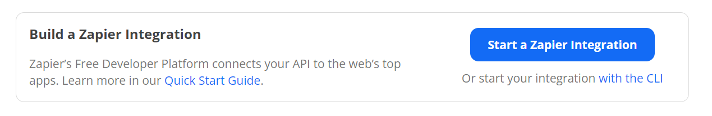

Fill out the form with the necessary details. Here I am only creating the bare minimum required information:
- Name: AbpZapier
- Description: Connecting ABP to Zapier
- Intended Audience: Private
- Role: I have no affiliation with {integration name}
- Category: Developer Tools
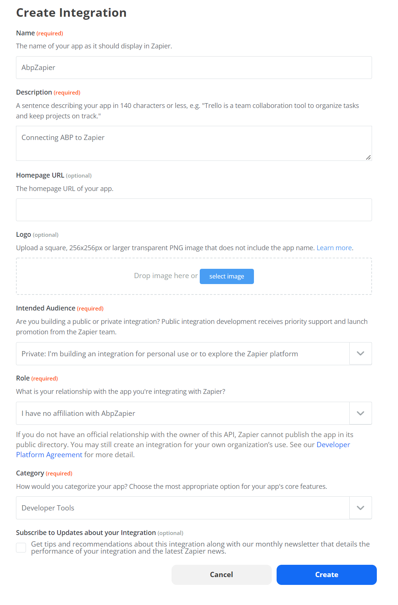

### Start the OAuth 2.0 authentication wizard
On the integration dashboard, click on the "Authentication" table on the left side, then choose the "OAuth v2" option and press the "Save" button.
 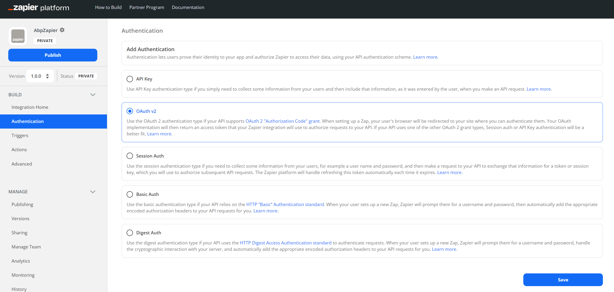

You will be taken to the authentication configuration wizard. 

### You can leave Step 1 defaulted
You can leave the "Configure your Fields" options defaulted in Step 1. I would like to note that if you had a specific tenant resolver (like the subdomain tenant resolver) configured you would want to create a field here for that. For the purposes of this article, we will be skipping Step 1 and leaving it defaulted.

### Copy the Redirect URL from Step 2, save for later
In the "Step 2" section, copy and set aside the "OAuth Redirect URL", you will need that for later.
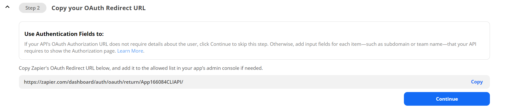

### Enter Client ID and Client Secret in Step 3, remember for later
In the "Step 3" section, enter a value for `Client ID` and `Client Secret` and save separately. We will need these later as well. When finished, press the "Save and Continue" button and then move on to Step 4.

For the demo I used the following values:
- Client ID: AbpZapier
- Client Secret: 1q2w3e*
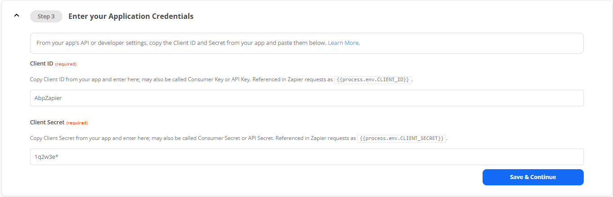

### Configure the endpoints
In the "Step 4" section, we are configuring our endpoints. The following details should be consistent with the default OpenIddict module setup. Replace the {domain name} value with your publicly routable domain name, i.e. `byteology.co`

The values used here are:
- Authorization URL: GET : https://{domain name}}/connect/authorize
- Scope: (we'll come back later and update this value)
- Access Token Request: POST : https://{{domain name}}/connect/token
- Test: GET : https://{{domain name}}/api/abp/api-definition

### Save the integration as it sits thus far
At this point, press the "Save and Continue" button to save your progress and we will switch over to the ABP application setup.
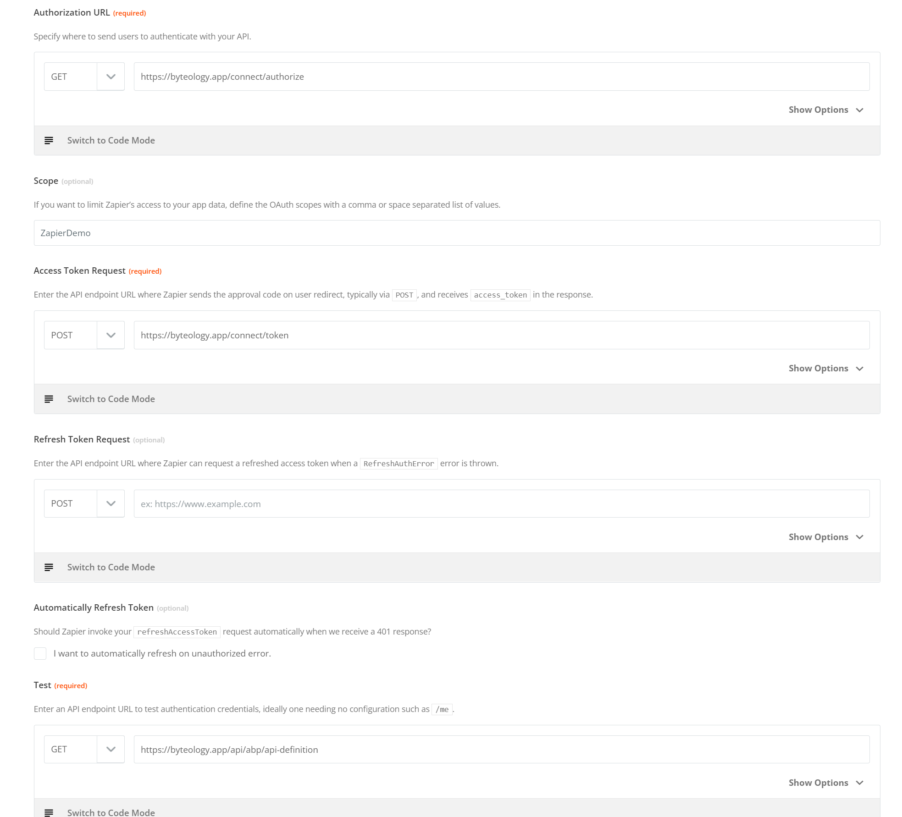

## Create the ABP Project

### Create the new project
I created a new project using the ABP CLI command `abp new ZapierDemo -t app -u mvc --mobile none --database-provider mongodb -csf --version 6.0.0-rc.1`

We are going to add a client for Zapier, and the easiest way I know to do that is to leverage the existing data seeding operations that ABP puts in there in the template projects.

### Add the client details to the appsettings.json file 
First, open the `appsettings.json` in the `dbmigrator` project. Under the `OpenIddict.Applications` section, add a new object with the following details:
```
"AbpZapier": {
        "ClientId": "{{ Client ID you set above (case sensitive) }}",
        "ClientSecret": "{{ Client Secret you set above }}",
        "RootUrl": "https://zapier.com",
        "RedirectUrl": "{{the Redirect URL you saved from Step 2 above}}"
      }
```


Also, while you are in here, make sure to update the connection string to whatever instance of MongoDB you are using. If you need it, [MongoDB Atlas](https://www.mongodb.com/pricing) does offer a free plan for development that is perfect for things like this.

### Update the OpenIddictDataSeedContributor with a new client configuration
Next, open the solution in your editor of choice, then open the `OpenIddictDataSeedContributor.cs` file in the `Domain` project.

Create the following method near the bottom:
```
private async Task CreateZapierApplicationAsync(List<string> commonScopes)
    {
        var configurationSection = _configuration.GetSection("OpenIddict:Applications");
        var zapierClientId = configurationSection["AbpZapier:ClientId"];
        if (!zapierClientId.IsNullOrWhiteSpace())
        {
            var zapierClientRootUrl = configurationSection["AbpZapier:RootUrl"].EnsureEndsWith('/');

            await CreateApplicationAsync(
                name: zapierClientId, //client ID you set in Zapier
                type: OpenIddictConstants.ClientTypes.Confidential, //confidential client, means it requires a client secret
                consentType: OpenIddictConstants.ConsentTypes.Implicit, // implicit conset means that it won't prompt for consent when you authenticate
                displayName: "AbpZapier", // whatever you want it to display as
                secret: configurationSection["AbpZapier:ClientSecret"] ?? "1q2w3e*", // secret you set in your zapier app
                grantTypes: new List<string>
                {
                    OpenIddictConstants.GrantTypes.AuthorizationCode, // zapier uses the OAuth 2.0 AuthorizationCode flow
                },
                scopes: commonScopes, 
                redirectUri: configurationSection["AbpZapier:RedirectUrl"], // this needs to match the Redirect URL supplied by Zapier
                clientUri: zapierClientRootUrl // this can technically be whatever, but we set it to https://zapier.com 
            );
        }
    }
```

Then put a reference to it at the bottom of the existing `CreateApplicationsAsync()` Method:
```
private async Task CreateApplicationsAsync()
    {
        var commonScopes = new List<string>
        {
            OpenIddictConstants.Permissions.Scopes.Address,
            OpenIddictConstants.Permissions.Scopes.Email,
            OpenIddictConstants.Permissions.Scopes.Phone,
            OpenIddictConstants.Permissions.Scopes.Profile,
            OpenIddictConstants.Permissions.Scopes.Roles,
            "ZapierDemo"
        };

        …

        await CreateZapierApplicationAsync(commonScopes); //add this line
    }
```
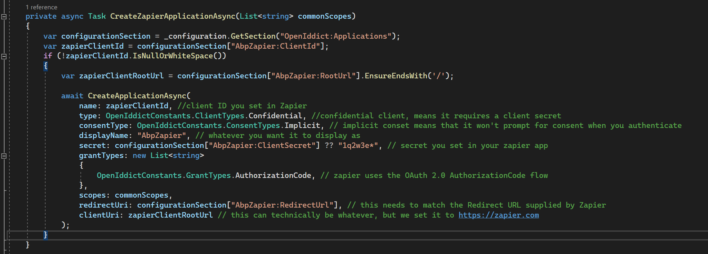

You will need to make note of the last scope in the `commonScopes` code, since this will be the scope that you need to use in Zapier and in some upcoming code in the Web module. For reference, the scope I am referring to in the codeblock above is `ZapierDemo`.
 
You can technically add the code directly into the `CreateApplicationsAsync` method, but I think this approach is cleaner.

### Run the DBMigrator project.
If using Visual Studio, right-click on the DBMigrator project and choose the "Debug => Start New Instance" step to stage your database with the essential details, including your new Zapier client.

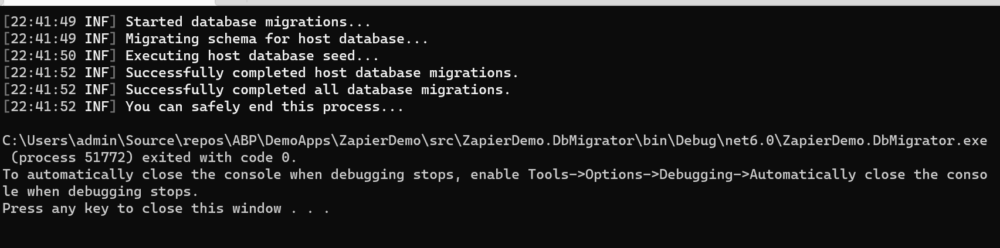

## Modify your development environment to allow for testing
Make the following modifications to the `launchSettings.json` in the *properties* folder of your **ZapierDemo.Web** project at this point:
- Change the `applicationUrl` values to match my domain: byteology.app
- Run the following command to tell IIS Express to bind my URL to the certificate I wanted to use:
	- `C:\Program Files (x86)\IIS Express\IisExpressAdminCmd.exe setupsslurl -url:https://byteology.app:443 -certhash:{{your chosen cert thumbprint}} `
	- kudos to [this article](https://improveandrepeat.com/2020/05/how-to-change-the-https-certificate-in-iis-express/) for showing me this trick.

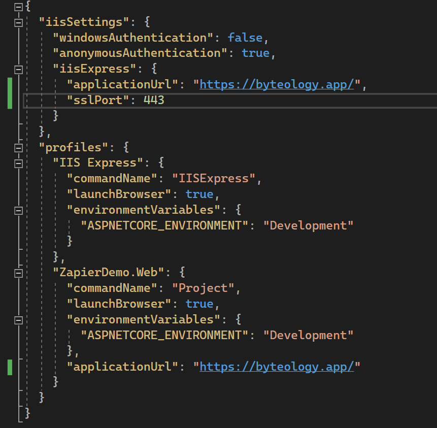

Save those changes, then relaunch Visual Studio as an administrator (this is to avoid an error with IIS Express launching using your new hostname settings).

At this point, your new application should be running and secured on the publicly routed domain of your choice.
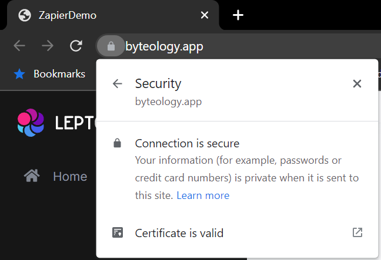

### Add the `Volo.Abp.OpenIddict.AspNetCore` package to your **ZapierDemo.Web** project
This will expose the controllers necessary for the `/connect/authorize` and `/connect/token` routes to function in your app. **This step is not necessary in an ABP Commercial project template.** Install the `Volo.Abp.OpenIddict.AspNetCore`  via your favorite method. For the purposes of this article, you can do so via the following steps:

- Open the ZapierDemo.Web.csproj file
- Add the following line inside one of the `<ItemGroup>` tags: `<PackageReference Include="Volo.Abp.OpenIddict.AspNetCore" Version="6.0.0-rc.1" />`
- Rebuild the project.

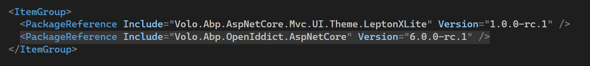

Once that line is added, navigate to the `ZapierDemoWebModule.cs` file in that same project and add the following line to your `[DependsOn(…` statement at the top: `typeof(AbpOpenIddictAspNetCoreModule)`

[Screenshot of the DependsOn statement at the top of the ZapierDemoWebModule class](images/zapierdemowebmodule_dependson.png)

In the `PreConfigureServices` method at the top of the class, add the following block of code:
```
PreConfigure<OpenIddictBuilder>(builder =>
        {
            builder.AddValidation(options =>
            {
                options.AddAudiences("ZapierDemo"); //note the scope from earlier is defined here. Change this is your scope is different.
                options.UseLocalServer();
                options.UseAspNetCore();
            });
        });
```

Then, in the `ConfigureServices` method, add this line: `context.Services.ForwardIdentityAuthenticationForBearer(OpenIddictValidationAspNetCoreDefaults.AuthenticationScheme);`

Finally, in the `OnApplicationInitialization` initialization method at the bottom of the module class, add the following line just before the `app.UserAuthorization()` call: `app.UseAbpOpenIddictValidation();`

## Back to Zapier to finish the initial integration
### Head back to the Zapier development console and test the authentication in Step 5

Navigate back to [the Zapier developer platform](https://developer.zapier.com/) and navigate back to your integration app's OAuth 2.0 authentication setup.

First thing, we will need to add the application scope to the authentication configuration in Step 4. This will need to match the value in the various places we configured inside your application earlier. Here you can see I entered `ZapierDemo`. When you are finised adding this, press the "Save & Continue" button to proceed with testing.
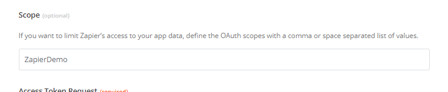

Next, move on to Step 5 to start testing.
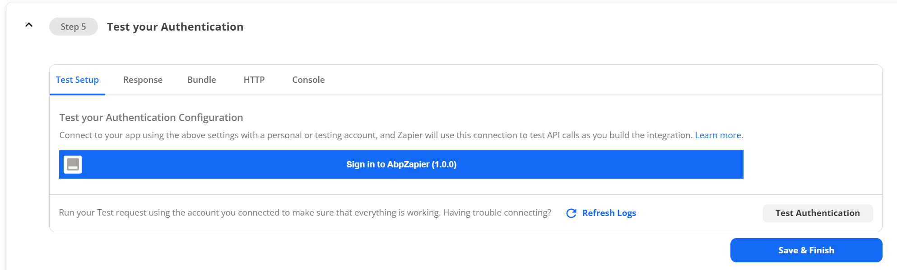

Click on the button labeled "Sign into AbpZapier (1.0.0)", and you SHOULD get a login window for your application.

[Login screen for your application](images/zapier_auth_testing_login_screen.png)

Enter your admin credentials and login. This should create a ZapierAccount for this integration. Once you see an available account, you should be able to hit the "Test Authentication" button which should display the output of a successfully request.

[Successful authentication test output in Zapier console](images/zapier_auth_successful_test.png)

## Conclusion

There you have it! You are now able to explore the triggers and actions components of a Zapier integration with your application, which will all you to perform a number of automation tasks against your internal API. I will be going over configuring a trigger and an action in the next part of this series.

Some important thing to note with this setup:
- For a production environment, it is recommended to create a separate user for this integration and use that account when you log into the application to authorize Zapier. This way you can granularly control the permissions assigned to that user (Zapier will get the permissions for the account you use to authorize it).
- This should work with the existing multi-tenancy configuration, but it might get tricky with a very custom tenant resolver. I have tested successfully with a standard subdomain resolver.
