# Introduction
This article builds on the foundation established in Part 1 of the series to show you how you can extend the functionality of your system with Zapier so you don't have to build and maintain a separate API code base for each interaction.

This will be a 3 part series covering different aspects of this process for clarity:

- [Part 1) Connecting your ABP app to Zapier](/part1/readme.md)
- [Part 2) Creating a Zap from the ABP API](/part2/readme.md)
- [Part 3) ABP Commercial CMSKit Social Automation](/part3/readme.md)

The third part of the series will not be contained within the source code and will focus primarily on the Zapier side, but it is an interesting use case for the setup (and my original motivation for figuring this out) so I thought I would include it.

# Source Code
The source code for the ABP application utilized during this article can be found [on Github](https://github.com/Byteology-LLC/ZapierDemo)

# Requirements
The code for this project requires the following:
	- ABP Framework 6.0.0-rc.1 (for latest available OpenIddict features)
	- MongoDb
	- Visual Studio (other IDEs will work, but this article has some Visual Studio specific stuff that you will need to adapt to any other IDE)

**Additionally, in order for Zapier to work correctly it will need to be able to access the API. Generally this means that you need to have a publicly routed domain name.**

If you need help, here is a really good article I found that helps walk you through setting up your development environment with a custom domain: <https://dotnetplaybook.com/custom-local-domain-using-https-kestrel-asp-net-core/>

You will also need an SSL certificate. Here are a few good resources for getting free LetsEncrypt certificates for domains you own for your personal projects:
- <https://certifytheweb.com/>
- <https://github.com/rmbolger/Posh-ACME>

If you are still struggling with allowing public access to your development environment, let me know if the comments and I will throw together a more comprehensive tutorial on how to get it done.

# Development

## Get comfortable with swagger
One of the many wonderful things that the ABP framework provides for us out of the box is a comprehensive and automatically generated OpenAPI documentation sheet. Navigate to your swagger instance by appending `/swagger/index.html` or simply `/swagger` to the end of your application URL. This document will be your guide as you develop triggers and actions inside Zapier, so I encourage you to keep it open for reference as we move along.

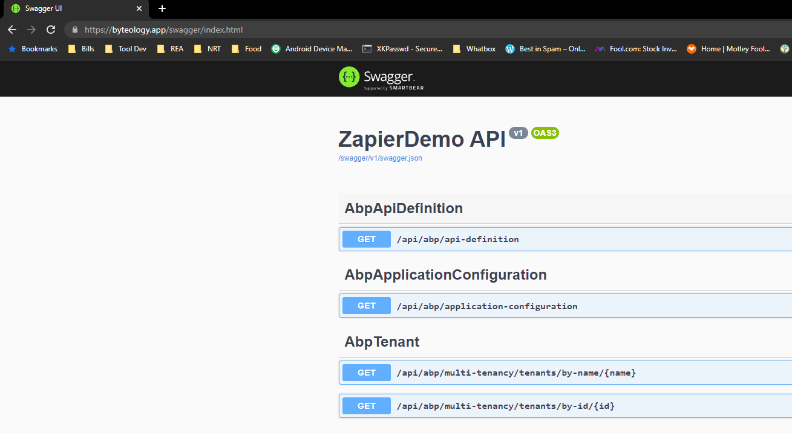

Specifically, for this article, you want to expand the section detailing the `GET /api/identity/users` endpoint and have that ready for later.
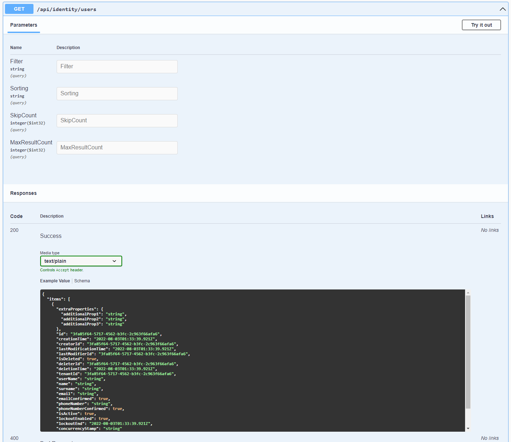

## Building a trigger in Zapier for the ABP framework.

### Trigger Settings
Naviate back to [the Zapier developer console](https://developer.zapier.com/) and open the custom integration we configured in Part 1. In the navigation menu on the left-side of the page, click "Triggers", then press the "Add Trigger" button.
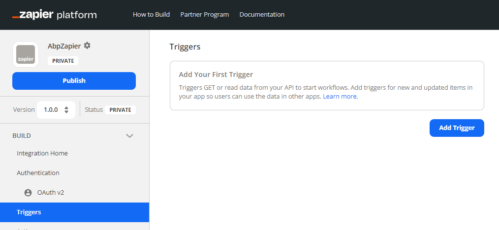

We are going to be creating a trigger that will fire in the event that a new user is created, so on the "settings" tab, fill out the details for that. The values I used were:
- Key: new_user
- Name: New User
- Noun: User
- Description: Triggers when a new user is created.

Press the "Save and Continue" button when you are done.

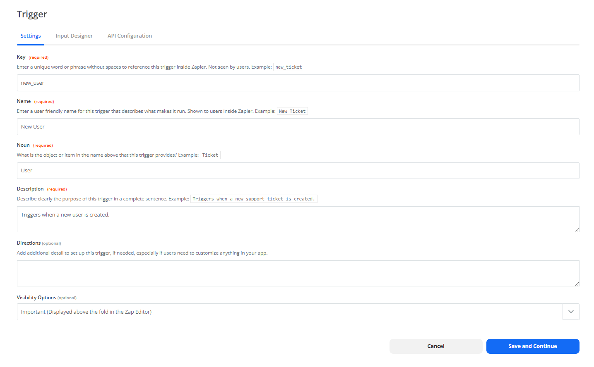

### Input Designer
The input designer is a pretty cool tool for variablizing user input for the API configuration step, but since we aren't looking for any specific user input here. If you want an example of how to configure this I will have an example in Part 3. For now, leave this blank and continue on to the "API Configuration" tab.

### API Configuration - Step 1
We'll go over this tab in a little bit more depth, since this is really the value that Zapier us adding to our processes.

In Step 1 on this tab, you choose a trigger type. There are currently two options (only one if you are using the free service):
- REST Hook (pro feature) : This is a webhook you would call from any external service into this trigger.
- Polling: Zapier will poll the API endpoint regularly and action on any new data returned in the responses. It has some internal witchcraft going on in the back end to keep track of enties that it has already actioned on, so you won't have to worry about tracking this separately.

In the "API Endpoint" section, we are going to have to get a little more involved that a standard API, simply because of the way the ABP framework packages the responses. 
 
First, referring back to the Swagger documentation you saved earlier, enter the endpoint URL for the `users` entity. In my case, it is `https://byteology.app/api/identity/users` and the method is `GET`.
 
Click the "Show Options" button to expand to parameters. 
 
I will also add the following "URL Params" to the query (again, referencing the Parameters shown in Swagger for guidance):
- Sorting: creationTime desc
- MaxResultCount: 25

We are essentially requesting the most recent 25 users created by the system. You can adjust the `MaxResultCount` to essentially any number if you think you will create more than 25 users in a single polling interval. 

Your input here show now look something like this:
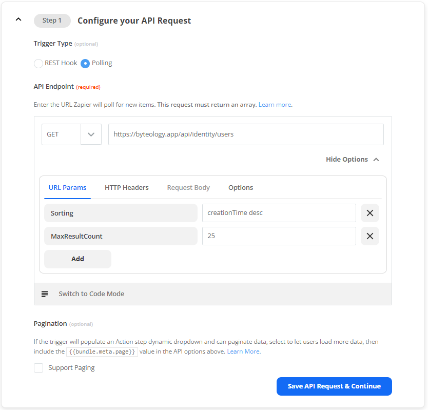

Now, this is where we diverge a little bit from the normal path. If you notice, right under the API Endpoint header you will see the following text: 
```
Enter the URL Zapier will poll for new items. **This request must return an array**.
```

This is where ABP makes it a little difficult for us, seeing as how the responses for the API are actually paginated responses with the array of results being a sub item. If you were to test the zapier now, it would fail becuase the array isn't the only thing being returned from the API.

To address this, click on the button that says "Switch to Code Mode". This will take the content that you entered into the form and transcribe that into the javascript code that powers the backend logic. **It only does this transcribing the FIRST time you click that button**. Filling the form first makes it easier to fix the code side because all of the details will be present and you won't necessarily have to dig too deep into Zapier's formatting.

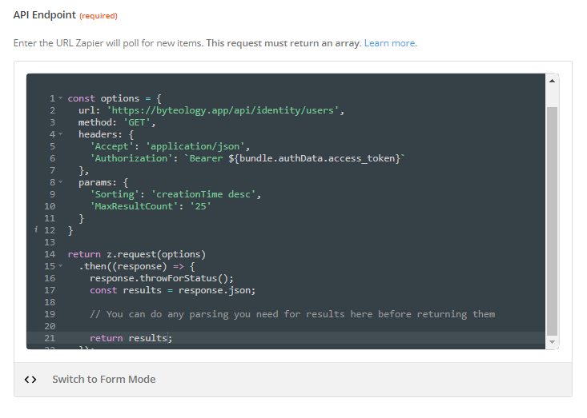

If you did everything correct, the fix for the API is easy. Just modify the return line (line 21 in my case) from `return results;` to `return results.items`.

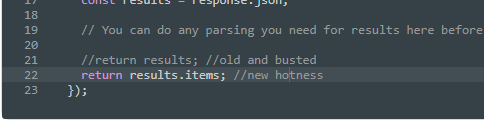

Now you can press the "Save API Request & Continue" button to move on to Step 2

### API Configuration - Step 2
If your "account" token has expired, you will need to open the dropdown menu and choose "Add a new account". Otherwise you can move on.
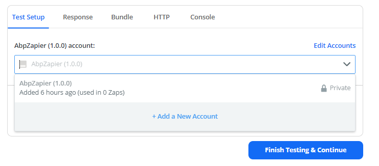

Pressing the "Test Your Request" button should return a successful test result.
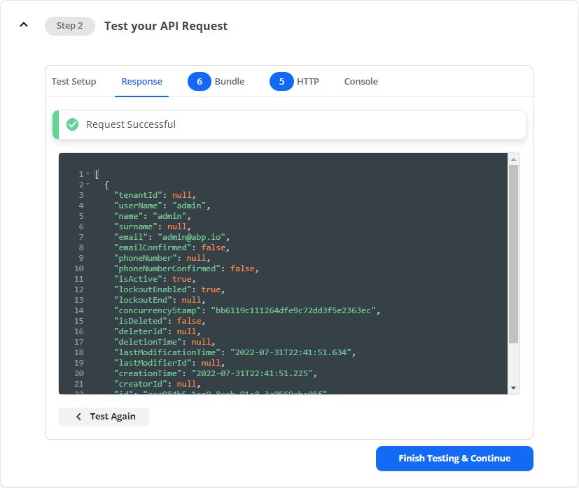

Press the "Finish Testing & Continue" button, then move into the "Define your Output" section in Step 3. Press the "Use Response from Test Data" to populate the json model from the successful test, then press the "Generate Output Field Definitions" to auto-populate the output fields.

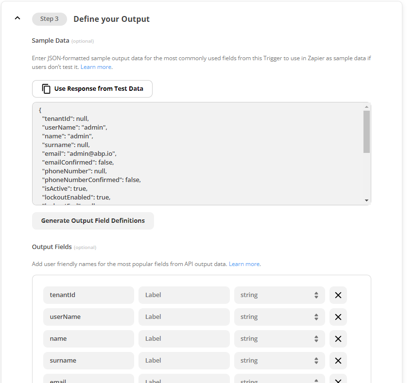

You can leave it like this if you like, I prefer to clean up the data a bit by adding Labels, defining data types, and removing fields that I know I am not going to use in my zaps. If you do that, your output will look something like this when all is said and done:
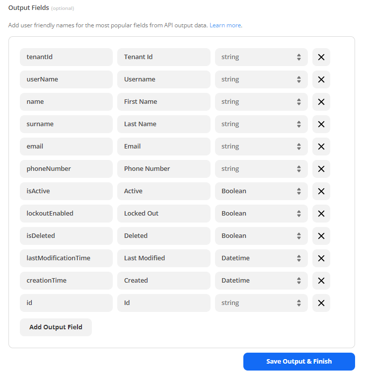

When you are satisfied, you can click on the "Save Output & Finish" button.

Congradulations! You now have a trigger that will fire automatically after a user is created in your system. Next step is to actually put that trigger to use in a Zap.

## Creating a Zap with your new trigger.

### Trigger Stage
Our goal here is to create a trigger that will send an email to new users welcoming them to the party (I know it's redundant since the ABP framework has this built in, I just wanted an easy example with real world use-cases).

Easiest way to get to a new Zap creation screen from where you are now is to scroll to the top of the page and click the "Create a Zap" button.
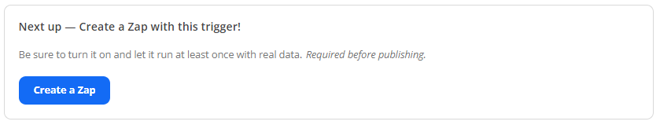

If you navigated away to celebreate your accomplisments thus far, you can get there by navigating to the [Zapier dashboard](https://zapier.com/app/dashboard) and clicking on the big orange "Create a Zap" button on the top of the sidebar menu.

Once there, in the trigger step, find your application in the list and click on it
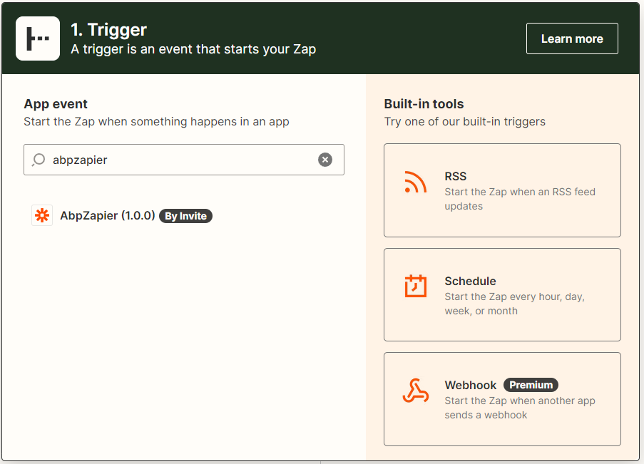

In the "Event" dropdown, choose the "New User" event, then press "Continue"
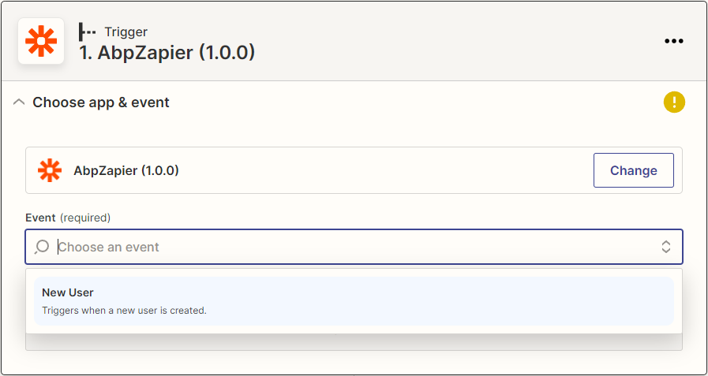

In the "Choose account" section, choose a currently valid account (if you have to create a new one here, it will prompt you to do so), then press continue.

In the "Test trigger" section, press the "Test trigger" button. It should be successful and it should pull the data for a user that you will use in the subsequent steps.
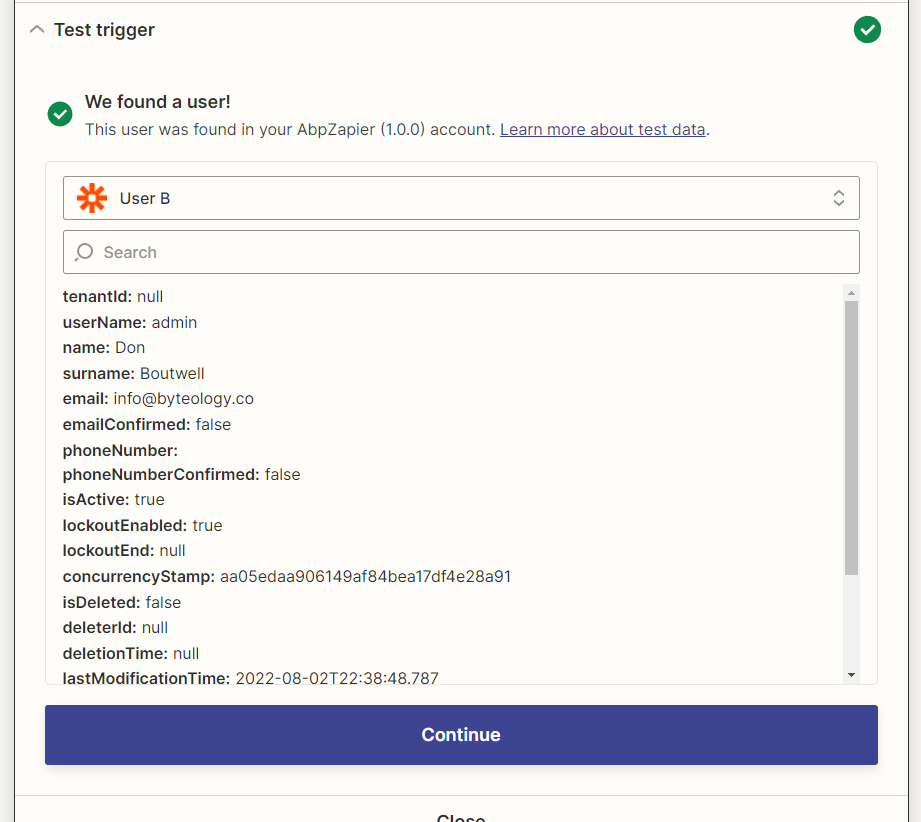

Press "Continue" to move on to the action stage.

### Action Stage
The action stage (or stages) are basically just what you want to have happen each time the trigger is fired. You can have more than one thing happen (you'll see an example of this in Part 3) or even have multi-stage workflows for events if you have a professional Zapier account. Prior to this step, I web into the admin account on our app and updated my personal details to be more descriptive.

For our purposes, we are just going to do a simple email. In the searchbox, look for "email" and choose the "Email by Zapier" option.
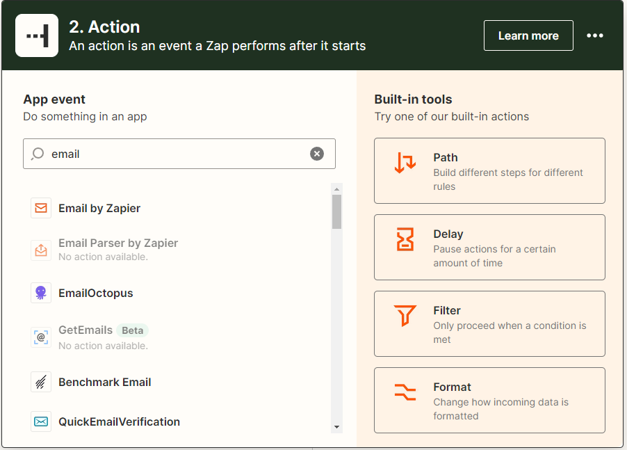

For our event, choose the "Send Outbound Email" and press "Continue"
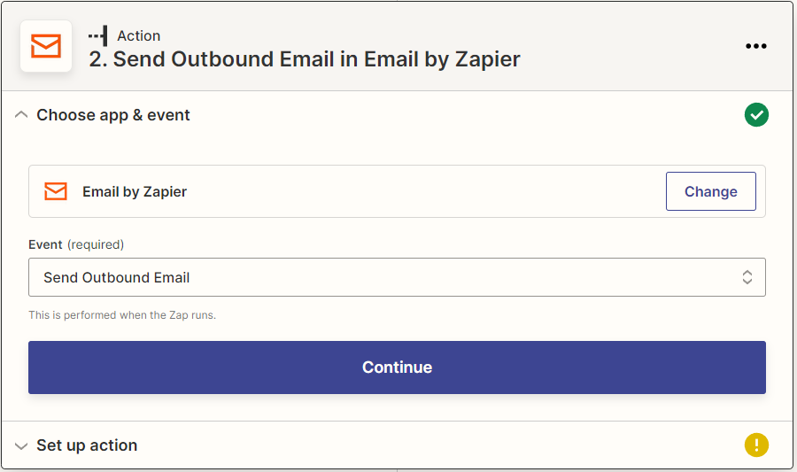

In the "Set up action" section, you will see a number of fields that are available to you. Clicking into one of these fields will show you available output from previous steps, in this case the output generated from our trigger. Fill out this form to meet your needs and press "Continue" when you are done
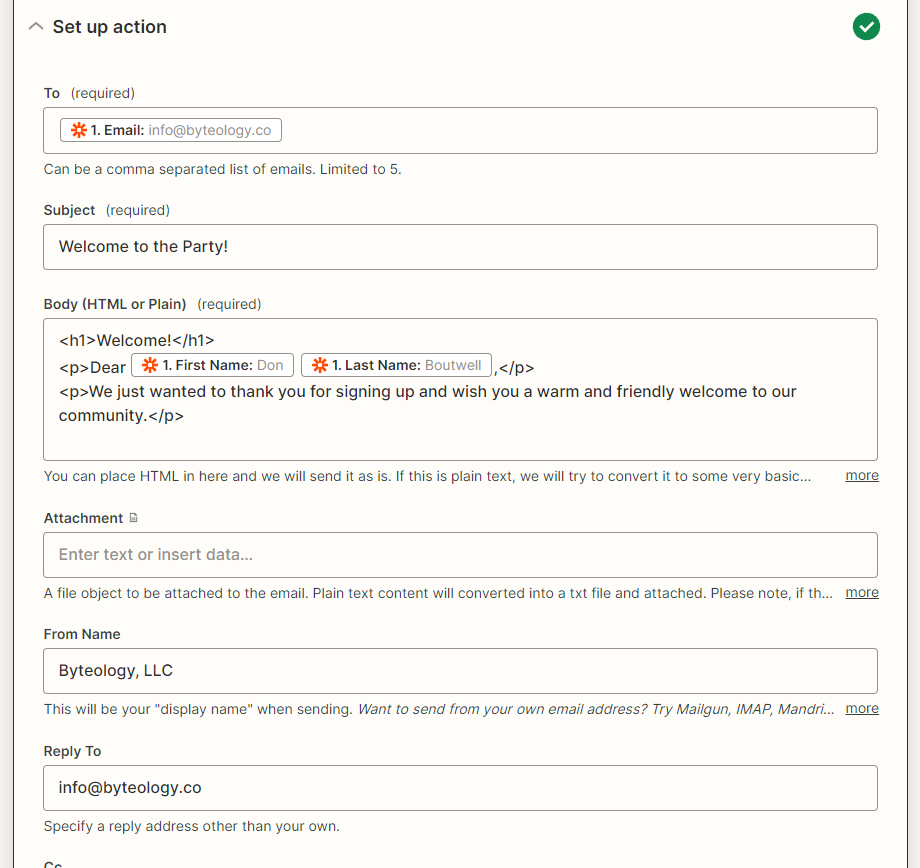

Validated the settings on the "Test action" section and press the "Test & continue" button if you are satisfied.
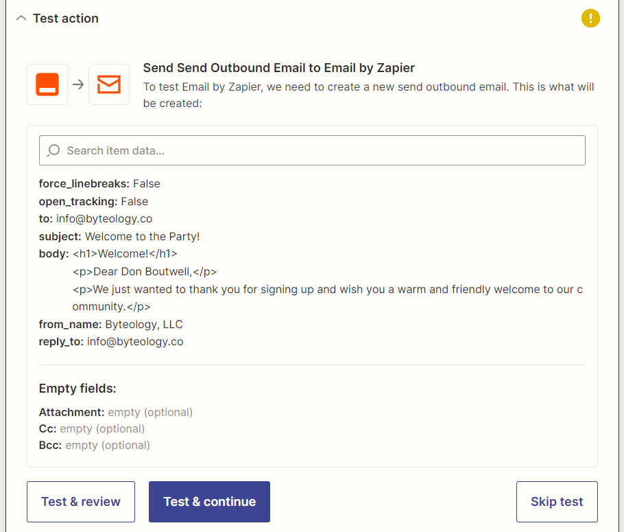

You should get the email formatted just the way you want it into whatever email address you had attached to that user.
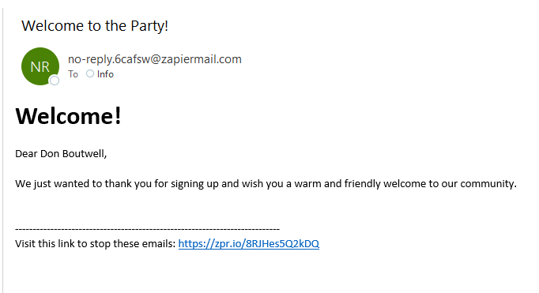

Tweak the action however you see fit, and when you are satisified with the results press the "Publish Zap" button to make it live.
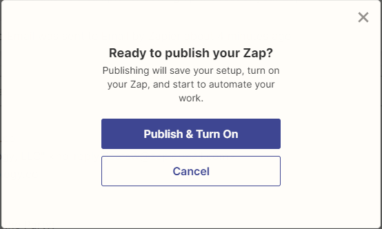

## The Real test
To test your new Zap in a real scenario, navigate back to your application and register a new user. The email that you registered the new email with should get that welcome email when the next polling interval is hit. You may want to tweak the email to include just the username instead of the first name and last name, since those aren't on the default registration page. Here is what I got when I registered my gmail account with a new user (then very quickly updated my personal details)
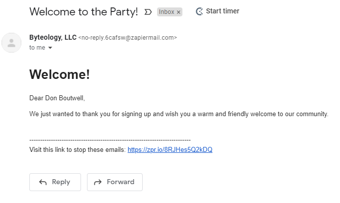


# Conclusion
This is a pretty basic walkthrough for a simple use case scenario, but there is a lot of power in the Zapier platform. They have 3800+ integrations and are growing regularly, so you can definently find something to meet your needs and make your life just a little bit easier.
